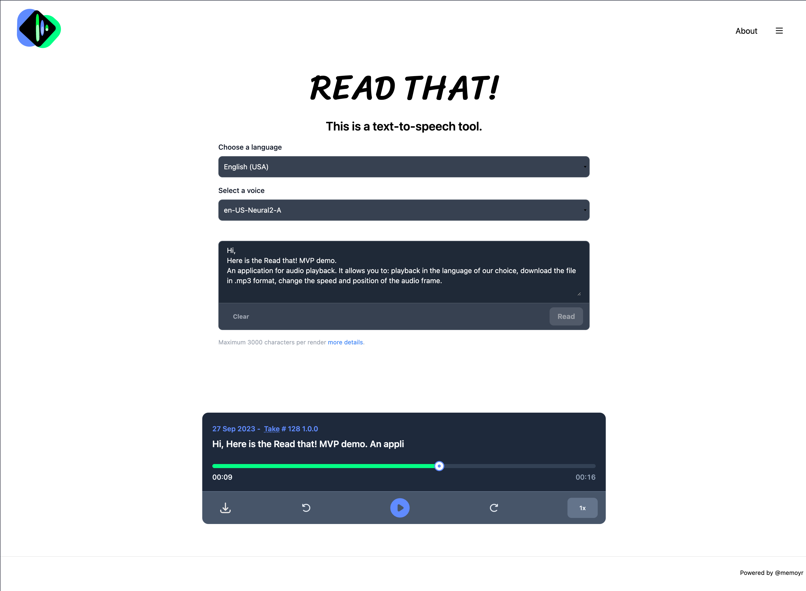

# React

I've been creating applications using Angular quite a few years now, so I thought it was the right moment to get back on a React project. My last professional project with React was over five years ago, so I wanted also to familiarize myself with the current state of the library. I had heard about hooks, functional components, and more, but hadn't gotten a chance to use them.

Lately, I've been reading a lot of text content online. This experience sparked the idea for the project, leading me to build a tool that would enable me to read for extended periods. I have additional ideas for expanding this app, but since the main objective has been met, I might regard this as a Minimum Viable Product (MVP).

The project also includes a few other elements that I wanted to incorporate:

- [TailwindCSS](https://tailwindcss.com/)
- Google cloud [console](https://console.cloud.google.com/) & [TTS API](https://cloud.google.com/text-to-speech)
- [Next.js](https://nextjs.org/)
- [NextAuth.js](https://next-auth.js.org/) (w/Google)

I've pushed the project on [GitHub](https://github.com/Memoyr/read-this-text-to-speech) if you want to try.

