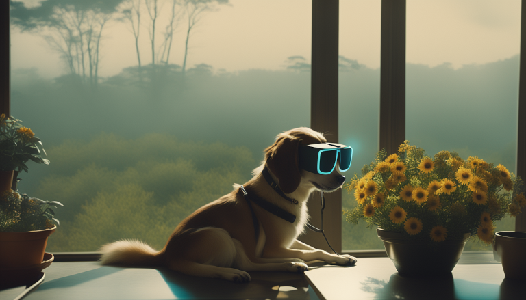

## AI Images Generation

I can't hide my excitement for the creative power these innovative tools offer. I want to extend my gratitude to all the intelligent individuals instrumental in this breakthrough.
Currently, I'm just beginning to navigate the intricate terrain of technicalities associated with this type of model. Until I can explain how it works in more details, I appreciate the results. The following one was created with the latest version of Stable Diffusion SDXL from [Stability-AI](https://github.com/Stability-AI/generative-models). 

