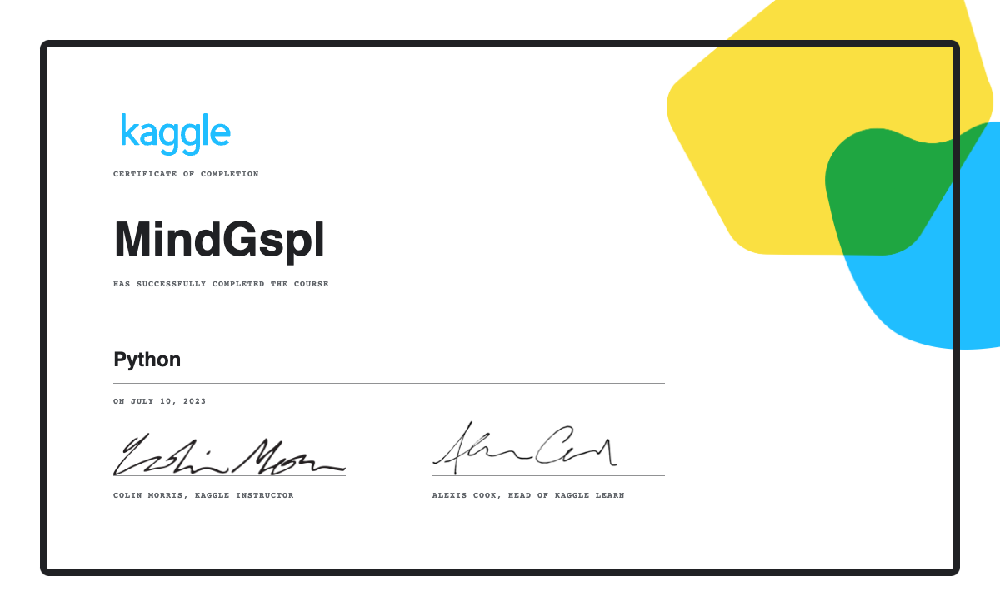
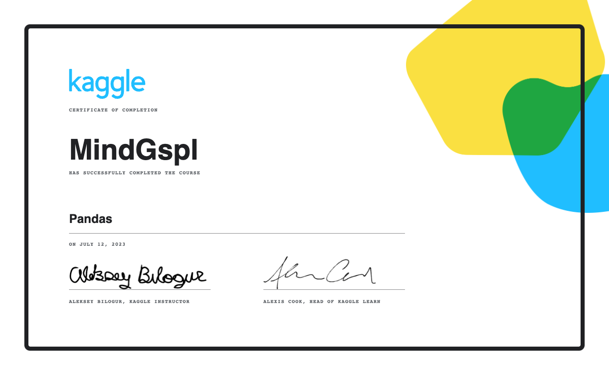
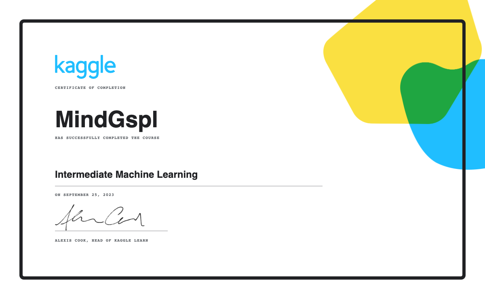

# My Studying Progress

I've been studying ML/DL almost full time for the past few months. I have completed the first 6 chapters of **Practical Deep Learning for Coders** from [Fastai](https://course.fast.ai/) course and my [MNIST project](https://mdev.ninja/posts/mnist-basis/) illustrate the result of what I've learned.
I've also completed a few Kaggle micro-courses:

- Python
- Pandas
- Intro to Machine Learning
- Intermediate Machine Learning

I've attached below the certificates I have received.
I've done also the first 4 lectures from [Neural Networks: Zero to Hero](https://www.youtube.com/playlist?list=PLAqhIrjkxbuWI23v9cThsA9GvCAUhRvKZ) course wich led me to complete my [MLP project](https://mdev.ninja/posts/mlp-exercise/).

I also wanted to test my knowledge of Python and data structures with some [leetcode](https://leetcode.com/mindgspl/) exercice problems.

I wish there's more than 24h in a day! I love what I do and I continue to progress 🤓

# Certificates

